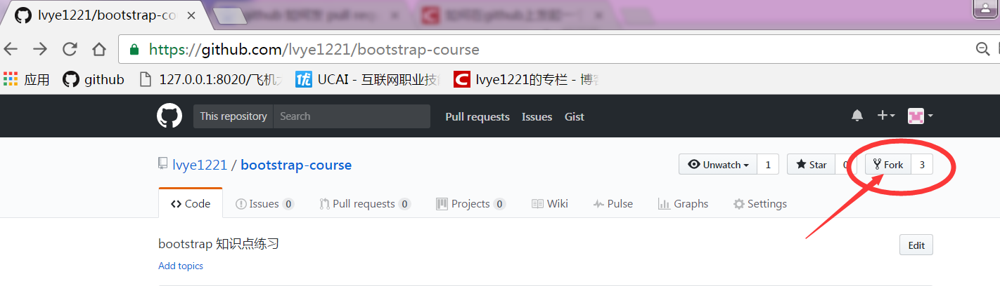
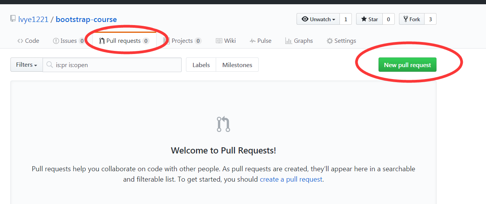
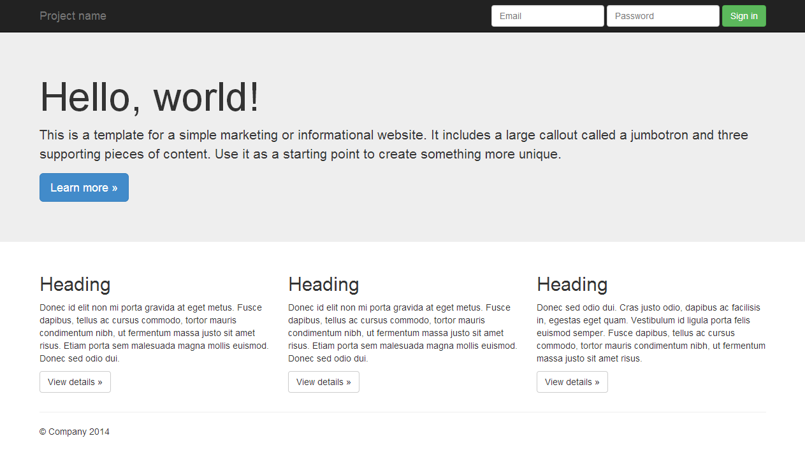
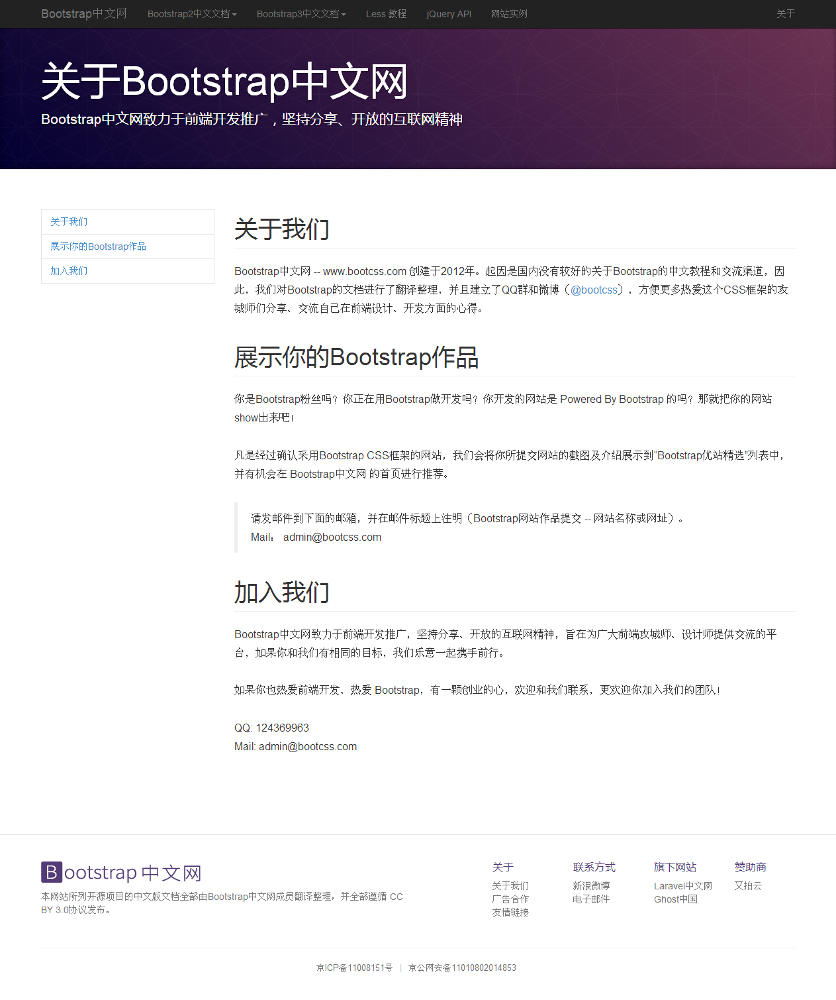
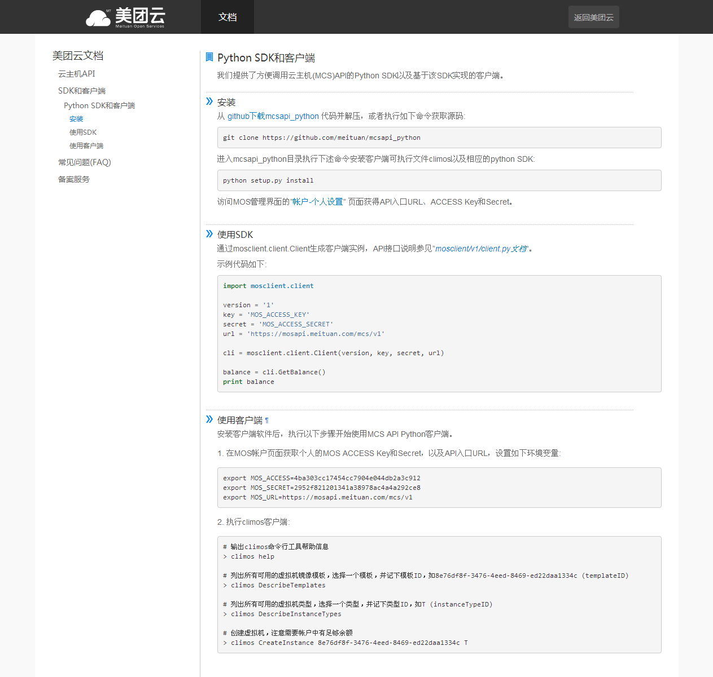

学习掌握 bootstrap， 给 Web 高级学员练习 Bootstrap 框架

# 步骤 #

## 一、跟踪项目代码 ##

1. 用自己账号登录 Github

2. 打开 https://github.com/lvye1221/bootstrap-course.git

3. 点击 Fork 按钮，如下图所示：

    

4. 在自己账户上，克隆 自己这个项目 到本地（以后在自己的项目中进行练习、提交）

5. 【以后】【如果需要】提交代码到原始处，通过 创建一个 “Pull Request”来实现

    

# 项目实战 #

## 页面框架 ##

【项目资源】[页面框架](material/bone.zip)

## 关于Bootstrap中文网 ##
	

【项目资源】[关于Bootstrap中文网](material/bootstrap-chinese.zip)

## Python SDK和客户端 — 美团云文档 ##
	

【项目资源】[Python SDK和客户端 — 美团云文档](material/meituan.zip)

## Python SDK和客户端 — 美团云文档 ##

效果如下：
	

【资料】[Python SDK和客户端 — 美团云文档  页面文字](text/meituan.txt)

# 参考资料 #

## 教程 ##

http://v3.bootcss.com/css/

